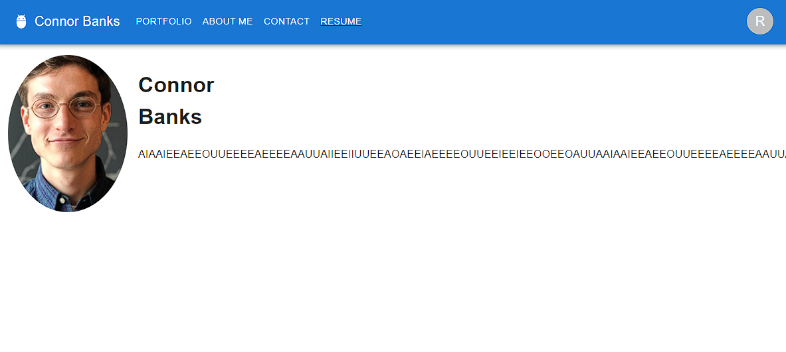

# React-Portfolio-CNRBanks

GitHub Repo - https://github.com/CNRBanks/React-Portfolio-CNRBanks

# Description

A portfolio template built with react.

# Table of Contents

- [Preview](#preview)
- [Installation](#installation)
- [Usage](#usage)
- [License](#license)
- [Contributing](#contributing)

# Preview

# Installation

Run npm install then npm run start

# Usage

Insert your own information or build from this code to create your own portfolio!

# License

MIT License

Copyright (c) 2022 Connor Banks

<blockquote>
Permission is hereby granted, free of charge, to any person obtaining a copy of this software and associated documentation files (the "Software"), to deal in the Software without restriction, including without limitation the rights to use, copy, modify, merge, publish, distribute, sublicense, and/or sell copies of the Software, and to permit persons to whom the Software is furnished to do so, subject to the following conditions:

The above copyright notice and this permission notice shall be included in all copies or substantial portions of the Software.

THE SOFTWARE IS PROVIDED "AS IS", WITHOUT WARRANTY OF ANY KIND, EXPRESS OR IMPLIED, INCLUDING BUT NOT LIMITED TO THE WARRANTIES OF MERCHANTABILITY, FITNESS FOR A PARTICULAR PURPOSE AND NONINFRINGEMENT. IN NO EVENT SHALL THE AUTHORS OR COPYRIGHT HOLDERS BE LIABLE FOR ANY CLAIM, DAMAGES OR OTHER LIABILITY, WHETHER IN AN ACTION OF CONTRACT, TORT OR OTHERWISE, ARISING FROM, OUT OF OR IN CONNECTION WITH THE SOFTWARE OR THE USE OR OTHER DEALINGS IN THE SOFTWARE.

</blockquote>

# Contributing

- Material UI - https://mui.com/
- React - https://reactjs.org/
- MDN Web Docs on React - https://developer.mozilla.org/en-US/docs/Learn/Tools_and_testing/Client-side_JavaScript_frameworks/React_getting_started

Getting Started
The application that you built for this module will help you know where to start when building your portfolio. You’ll use Create React App just as you did with your module project, but you should be aware of a few structural differences in the component hierarchy. Your portfolio should include the following:

A single Header component that appears on multiple pages

A single Navigation component within the header that will be used to conditionally render the different sections of your portfolio

A single Project component that will be used multiple times in the Portfolio section

A single Footer component that appears on multiple pages

NOTE
The contact form should be similar to the one you built in the module project. Because this application doesn’t include a back end or connect to an API, you can set up this functionality the same way you did in the module project and add in back-end functionality after you’ve covered it in the next few weeks.

In the meantime, consider adding your email address and phone number on the Contact page.

Projects
For each project you feature in your portfolio, you should include the following:

An image of the deployed application (either a GIF or a screenshot)

The title of the project

A link to the deployed application

A link to the corresponding GitHub repository

Design
As with the previous portfolio Challenge, remember that "good" design is subjective; however, your site should look polished. Here are a few guidelines on what that means:

Use mobile-first design.

Choose a color palette so that your site doesn't just look like the default Bootstrap theme or an unstyled HTML site. Look into resources like Coolors Links to an external site.or another color scheme generator to help you create something that will stand out.

Make sure the font size is large enough to read and that the colors don't cause eye strain.

Consider using animations and React component libraries. Note that this will not affect your grade, but it may impact how potential employers gauge your knowledge.

Grading Requirements
NOTE
If a Challenge assignment submission is marked as “0”, it is considered incomplete and will not count towards your graduation requirements. Examples of incomplete submissions include the following:

A repository that has no code

A repository that includes a unique name but nothing else

A repository that includes only a README file but nothing else

A repository that only includes starter code

This Challenge is graded based on the following criteria:

Technical Acceptance Criteria: 40%
Satisfies all of the preceding acceptance criteria plus the following:

Application must use React to render content.

Application has a single Header component that appears on multiple pages, with a Navigation component within it that’s used to conditionally render About Me, Portfolio, Contact, and Resume sections.

Application has a single Project component that’s used multiple times in the Portfolio section.

Application has a single Footer component that appears on multiple pages.

Application must be deployed to GitHub Pages.

Deployment: 32%
Application deployed at live URL.

Application loads with no errors.

Application GitHub URL submitted.

GitHub repository contains application code.

Application Quality: 15%
User experience is intuitive and easy to navigate.

User interface style is clean and polished.

Application uses a color scheme other than the default Bootstrap color palette.

Repository Quality: 13%
Repository has a unique name.

Repository follows best practices for file structure and naming conventions.

Repository follows best practices for class/id naming conventions, indentation, quality comments, etc.

Repository contains multiple descriptive commit messages.

Repository contains a high-quality README file with description, screenshot, and link to deployed application.

How to Submit the Challenge
You are required to submit BOTH of the following for review:

The URL of the functional, deployed application.

The URL of the GitHub repository, with a unique name and a README describing the project.